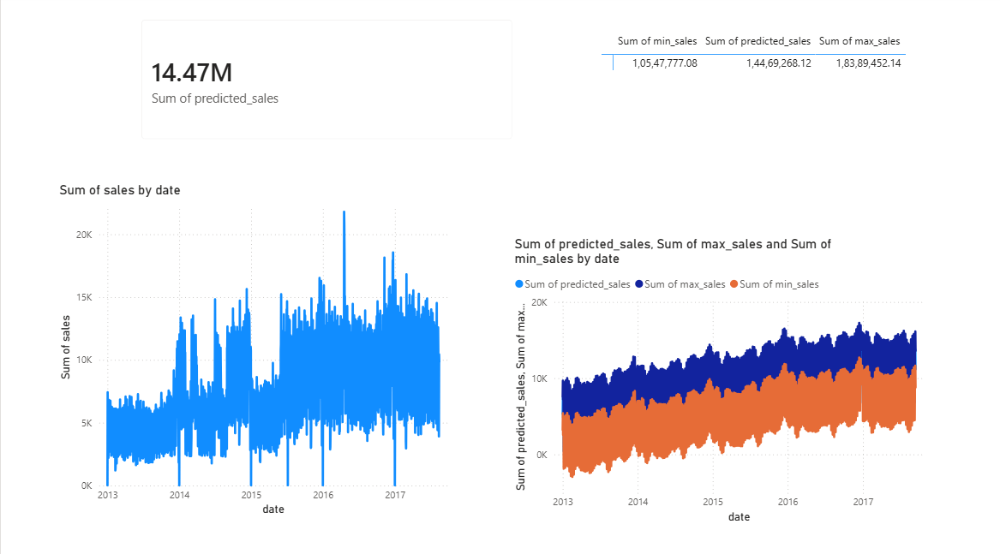

# Intelligent Supply Chain Demand & Inventory Forecaster

An end-to-end Data Engineering and Machine Learning pipeline that predicts future inventory demand to optimize supply chain operations. 

## 🏗️ Project Architecture
1. **Data Extraction:** Raw dataset sourced from Kaggle.
2. **ETL Pipeline (Python/Pandas):** Cleaned, filtered, and aggregated daily sales data.
3. **Database (MySQL):** Stored cleaned historical data and ML predictions for enterprise access.
4. **Machine Learning (Meta Prophet):** Trained a time-series forecasting model to predict 30-day future demand along with confidence intervals (best/worst case scenarios).
5. **Business Intelligence (Power BI):** Connected live to MySQL to build an executive dashboard featuring KPI cards, forecast trendlines, and daily inventory matrix.

## 🛠️ Tech Stack
* **Language:** Python
* **Data Processing:** Pandas, SQLAlchemy
* **Database:** MySQL
* **Machine Learning:** Prophet
* **Visualization:** Power BI

## ⚙️ Features
* Automated ETL workflow
* Handling of missing data and date hierarchies
* 30-day accurate demand forecasting with risk margins (min/max sales)
* Interactive executive dashboard for inventory planning
## 📊 Dashboard Preview

